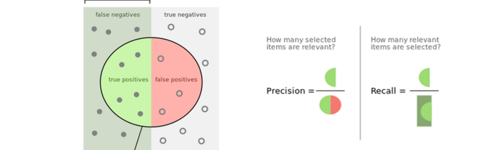
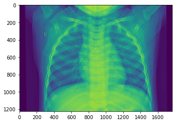
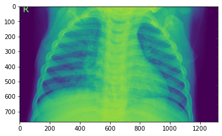

# Image Classification of Chest X-rays using a Convolutional Neural Network


## Table Of Contents


- [Introduction](#introduction)
- [Setup Instructions](#setup-instructions)
  * [Log in to the AWS console and create a notebook instance](#log-in-to-the-aws-console-and-create-a-notebook-instance)
  * [Use git to clone the repository into the notebook instance](#use-git-to-clone-the-repository-into-the-notebook-instance)
- [Machine Learning Pipeline](#machine-learning-pipeline)
  * [Step 1 - Data collection](#step-1---data-collection)
  * [Step 2 - Data cleaning](#step-2---data-cleaning)
  * [Step 3 - Feature labelling](#step-3---feature-labelling)
  * [Step 4 - Convolutional Neural Network (CNN) architecture](#step-4---convolutional-neural-network-cnn-architecture)
  * [Step 5 - Model training](#step-5---model-training)
  * [Step 6 - Deploying the trained model for testing](#step-6---deploying-the-trained-model-for-testing)
  * [Step 7 - Model validation using a batch transform job](#step-7---model-validation-using-a-batch-transform-job)
  * [Step 8 - Using the deployed model for the web application](#step-8---using-the-deployed-model-for-the-web-application)
    + [Part A - Declaring an IAM Role for the Lambda function](#part-a---declaring-an-iam-role-for-the-lambda-function)
    + [Part B - Creating a Lambda function](#part-b---creating-a-lambda-function)
    + [Part C - Setting up the API Gateway](#part-c---setting-up-the-api-gateway)
    + [Part D - Deploying the web application](#part-d---deploying-the-web-application)
  * [Important - Deleting the endpoint](#important---deleting-the-endpoint)


## Introduction


For this project, I trained a [Convolutional Neural Network (CNN)](https://en.wikipedia.org/wiki/Convolutional_neural_network) to take in images of chest x-rays as input and output a prediction rounded to '1' or '0' signifying if the patient showed signs of pneumonia or a normal diagnosis, respectively. Everything for this project was done on Amazon Web Services (AWS) and the SageMaker platform, as the goal of this project was to reinforce my familiarity with the AWS ecosystem.


Another component of this project was a front-end that could be used to upload images to pass through to the model and serve predictions. The diagram below illustrates the flow of input from the web application to the model hosted on AWS, which is called using a Lambda function via a REST API. After the predictor performs inference on the given input, it is returned to the web application via the Lambda function.


## Setup Instructions


The notebook in this repository is intended to be executed using Amazon's SageMaker platform and the following is a brief set of instructions on setting up a managed notebook instance using SageMaker.


### Log in to the AWS console and create a notebook instance


Log in to the AWS console and go to the SageMaker dashboard. Click on 'Create notebook instance'. The notebook name can be anything and using ml.t2.medium is a good idea as it is covered under the free tier. For the role, creating a new role works fine. Using the default options is also okay. Important to note that you need the notebook instance to have access to S3 resources, which it does by default. In particular, any S3 bucket or object with 'sagemaker' in the name is available to the notebook.


### Use git to clone the repository into the notebook instance


Once the instance has been started and is accessible, click on 'Open Jupyter' to get to the Jupyter notebook main page. To start, clone this repository into the notebook instance.


Click on the 'new' dropdown menu and select 'terminal'. By default, the working directory of the terminal instance is the home directory, however, the Jupyter notebook hub's root directory is under 'SageMaker'. Enter the appropriate directory and clone the repository as follows.


```
cd SageMaker
git clone https://github.com/Supearnesh/ml-chestxray-cnn.git
exit
```


After you have finished, close the terminal window.


## Machine Learning Pipeline


This was the general outline followed for this SageMaker project:


1. Data collection
2. Data cleaning
3. Feature scaling
4. Convolutional Neural Network (CNN) architecture
5. Model training
6. Deploying the trained model for testing
7. Model validation using a batch transform job
8. Using the deployed model for the web application
    * a. Declaring an IAM Role for the Lambda function
    * b. Creating a Lambda function
    * c. Setting up the API Gateway
    * d. Deploying the web application


### Step 1 - Data collection


The [Chest X-Ray Images (Pneumonia) dataset](https://www.kaggle.com/paultimothymooney/chest-xray-pneumonia) contains over 5,000 images of chest x-rays with pneumonia and normal diagnoses, which were used to train this model. This dataset was downloaded locally and uploaded to S3 using the [AWS S3 interface](https://console.aws.amazon.com/s3). It can also be uploaded directly via the Jupyter interface in Amazon SageMaker so files can be referenced locally, as shown below.


```python
from glob import glob

# Create a list 'files' of the 5856 downloaded images saved locally
xray_files = np.array(glob('chestXrays/all/*'))

# Check that file names have been stored correctly
xray_files
```


    array(['chestXrays/all/person281_bacteria_1328.jpeg',
           'chestXrays/all/person294_bacteria_1380.jpeg',
           'chestXrays/all/person998_bacteria_2927.jpeg', ...,
           'chestXrays/all/IM-0312-0001.jpeg',
           'chestXrays/all/person260_bacteria_1223.jpeg',
           'chestXrays/all/person25_bacteria_115.jpeg'], dtype='<U45')


### Step 2 - Data cleaning


It is important to understand the distribution of the dataset and look for any inconsistencies that may cause problems during model training. For instance, the images that are present in the dataset are grayscale images and should only have 1 channel, as opposed to RGB images that have 3 channels. For this purpose, it is much simpler to create a DataFrame using Pandas to apply functions to entire columns at once.


```python
# Create a dataframe with file names so we can use 'apply()' later to transform images to tensors
xray_df = pd.DataFrame(data=xray_files, columns=['file_name'])
```


The images are rectangular and have roughly a 0.7 ratio so the images are resized to 112x160, maintaining the approximate original height and width ratio. After resizing, the images are converted to [tensors](https://en.wikipedia.org/wiki/Tensor). By converting all of the images to tensors and checking their shape, we can confirm that the images have been resized accordingly.


```python
# Simple function to transform the images for processing
def to_tensor(img_url):
    transform = T.Compose([T.Resize((112,160)), T.ToTensor()])
    return transform(Image.open(img_url))
```


```python
# Verify tensor shape across a few samples
for xray in xray_files[:5]:
    print(to_tensor(xray).shape)
    
to_tensor(xray_files[0]).shape[0]
```

    torch.Size([1, 112, 160])
    torch.Size([1, 112, 160])
    torch.Size([1, 112, 160])
    torch.Size([1, 112, 160])
    torch.Size([1, 112, 160])


    1


A separate column can be created to stored the number of channels for each image. The first number from the shape of the tensors produced signifies the number of channels. For most images, this value is equal to 1, which corresponds to grayscale images.


```python
# Create a new column 'tensor' with the to_tensor() function applied to 'file_name'
xray_df['tensor'] = xray_df['file_name'].apply(to_tensor)
```


```python
# Create a new function to get shape of tensors that can be applied to a dataframe column
def get_shape(tensor):
    return tensor.shape[0]
```


```python
# Test the get_shape() function to ensure it works properly
get_shape(xray_df['tensor'][0])
```


    1


```python
xray_df['channels'] = xray_df['tensor'].apply(get_shape)
```


The number of channels can be pulled from the eponymous column in the dataframe. If the number is greater than 1, then it can be categorized RGB image.


```python
# Check to make sure all images are grayscale and have 1 channel
xray_df[xray_df['channels']>1]['file_name'].head()
```


    Series([], Name: file_name, dtype: object)


The code below shows how to filter out any data points that are not grayscale so that the input to the CNN maintains the same number of channels.


```python
import os

# Remove any color images with 3 channels

count = 0

for file in xray_df[xray_df['channels']>1]['file_name']:
    os.remove(file)
    count+=1

print('{} files removed.'.format(count))
```

    0 files removed.


### Step 3 - Feature scaling


For the model to train most effectively, it helps if the image tensors are normalized using the mean and standard deviation of the total population. In order to use these values for normalization, they first need to be calculated using the code below.


```python
# Calculate mean and standard deviation of image tensors
tensor_vals = []

for tensor in xray_df['tensor'][:4]:
    tensor_vals.append(tensor.mean())

img_mean = np.mean(tensor_vals)
img_std = np.std(tensor_vals)
    
print('mean: {}'.format(img_mean))
print('std: {}'.format(img_std))
```

    mean: 0.4954160153865814
    std: 0.05647209659218788


The mean and standard deviation can then be used with the torchvision library to normalize the image tensors before using them for training the CNN.


```python
from torchvision import transforms as T

transform = T.Compose([T.Resize((112, 160)),
                           T.ToTensor(),
                           T.Normalize(mean=(0.4954160,),
                                       std=(0.0564721,))])
```


### Step 4 - Convolutional Neural Network (CNN) architecture


To give a brief overview on the structure of neural networks, they typically consist of connected nodes organized by layers, with an input layer, an output layer and some number of hidden layers in between. At a very high level, the input layer is responsible for taking in data, the hidden layers apply some changes to that data, and the output layer yields the result. There was one CNN built for this project from scratch. The goal was to understand the architecture of a CNN better by building one from scratch and train it to understand what kind of results are possible for such a model. The following paper was instrumental for developing a firm understanding of CNNs and for learning strategies to increase performance by decreasing overfitting.


> Alex Krizhevsky, Ilya Sutskever, and Geoffrey Hinton. [ImageNet Classification with Deep Convolutional Neural Networks](https://www.cs.toronto.edu/~hinton/absps/imagenet.pdf). In _Proceedings of NIPS_, 2012.


This CNN contains five convolutional layers, all normalized and max-pooled, and two fully connected layers with dropout configured at 50% probability. This architecture was modeled after AlexNet. All layers use Rectified Linear Units (ReLUs) for their documented reduction in training times. With these measures in place, the trained model performed quite well, even after just 25 epochs for training. The validation loss was steadily decreasing, and it is possible that if more training epochs were allocated the results could have been even more astounding. As this was a binary classification problem of identifying chest x-ray images indicating whether the patient had pneumonia, the model managed to identify a majority of the positive class correctly while also including a fair number of false positives. For this particular problem, it is more important to identify images in the positive class correctly, so having a high recall is particularly important. That being said, the precision of the model was at 0.697 and recall at 0.995, an image illustrating the calculation is included below.


> Vinod Nair and Geoffrey Hinton. [Rectified Linear Units Improve Restricted Boltzmann Machines](https://www.cs.toronto.edu/~fritz/absps/reluICML.pdf). In _Proceedings of ICML_, 2010.





```python
import torch
import torch.nn as nn
import torch.nn.functional as F

# Define the CNN architecture
class CNNClassifier(nn.Module):
    ### 5 layer architecture with 2 fully connected layers
    def __init__(self):
        super(CNNClassifier, self).__init__()
        ## Define layers of a CNN
        # convolutional layer (sees 112x160x3 tensor)
        self.conv_01 = nn.Conv2d(in_channels=3, out_channels=16, kernel_size=3, stride=1, padding=1)
        # batch normalization applied to convolutional layer
        self.norm_01 = nn.BatchNorm2d(16)
        # convolutional layer (sees 56x80x16 tensor)
        self.conv_02 = nn.Conv2d(in_channels=16, out_channels=32, kernel_size=3, stride=1, padding=1)
        # batch normalization applied to convolutional layer
        self.norm_02 = nn.BatchNorm2d(32)
        # convolutional layer (sees 28x40x32 tensor)
        self.conv_03 = nn.Conv2d(in_channels=32, out_channels=64, kernel_size=3, stride=1, padding=1)
        # batch normalization applied to convolutional layer
        self.norm_03 = nn.BatchNorm2d(64)
        # convolutional layer pooled (sees 14x20x64 tensor)
        self.conv_04 = nn.Conv2d(in_channels=64, out_channels=128, kernel_size=3, stride=1, padding=1)
        # batch normalization applied to convolutional layer
        self.norm_04 = nn.BatchNorm2d(128)
        # convolutional layer pooled (sees 7x10x128 tensor)
        self.conv_05 = nn.Conv2d(in_channels=128, out_channels=256, kernel_size=3, stride=1, padding=1)
        # batch normalization applied to convolutional layer
        self.norm_05 = nn.BatchNorm2d(256)
        # max pooling layer
        self.pool = nn.MaxPool2d(kernel_size=2, stride=2)
        # linear layer (15 * 256 -> 2048)
        self.fc_01 = nn.Linear(15 * 256, 2048)
        # linear layer (2048 -> 2)
        self.fc_02 = nn.Linear(2048, 2)
        # dropout layer (p = 0.50)
        self.dropout = nn.Dropout(0.50)
    
    def forward(self, x):
        ## Define forward behavior
        # add sequence of convolutional and max pooling layers
        x = self.pool(F.relu(self.norm_01(self.conv_01(x))))
        x = self.pool(F.relu(self.norm_02(self.conv_02(x))))
        x = self.pool(F.relu(self.norm_03(self.conv_03(x))))
        x = self.pool(F.relu(self.norm_04(self.conv_04(x))))
        x = self.pool(F.relu(self.norm_05(self.conv_05(x))))
        # flatten image input
        x = x.view(-1, 15 * 256)
        # add dropout layer
        x = self.dropout(x)
        # add first hidden layer, with relu activation function
        x = F.relu(self.fc_01(x))
        # add dropout layer
        x = self.dropout(x)
        # add second hidden layer, with relu activation function
        x = self.fc_02(x)
        return x
```


### Step 5 - Model training


A model consists of model artifacts, training code, and inference code; each of these components interact with each other. The neural network was trained in PyTorch with the `entry_point` configured as the `train.py` file located in the `train` folder.


```python
import json
import boto3
import sagemaker
from sagemaker.pytorch import PyTorch

sagemaker_session = sagemaker.Session()

bucket = 's3://chest-xrays'

role = 'arn:aws:iam::578203129999:role/service-role/AmazonSageMaker-ExecutionRole-20200419T032205'  

estimator = PyTorch(
    entry_point='train.py',
    source_dir='train',
    role=role,
    framework_version='1.4.0',
    py_version='py3',
    instance_count=1,
    instance_type='ml.p2.xlarge',
    hyperparameters={
        'epochs': 25,
        'batch-size': 1
    }
)

estimator.fit({
    'training': bucket+'/train'
})
```

    2021-04-24 05:21:21 Starting - Starting the training job...
    2021-04-24 05:21:46 Starting - Launching requested ML instancesProfilerReport-1619241680: InProgress
    ......
    2021-04-24 05:22:46 Starting - Preparing the instances for training............
    2021-04-24 05:24:47 Downloading - Downloading input data.........
    2021-04-24 05:26:07 Training - Downloading the training image......
    2021-04-24 05:27:18 Training - Training image download completed. Training in progress..bash: cannot set terminal process group (-1): Inappropriate ioctl for device
    bash: no job control in this shell
    2021-04-24 05:27:20,288 sagemaker-containers INFO     Imported framework sagemaker_pytorch_container.training
    2021-04-24 05:27:20,316 sagemaker_pytorch_container.training INFO     Block until all host DNS lookups succeed.
    2021-04-24 05:27:20,530 sagemaker_pytorch_container.training INFO     Invoking user training script.
    2021-04-24 05:27:21,107 sagemaker-containers INFO     Module default_user_module_name does not provide a setup.py. 
    Generating setup.py
    2021-04-24 05:27:21,107 sagemaker-containers INFO     Generating setup.cfg
    2021-04-24 05:27:21,107 sagemaker-containers INFO     Generating MANIFEST.in
    2021-04-24 05:27:21,108 sagemaker-containers INFO     Installing module with the following command:
    /opt/conda/bin/python3.6 -m pip install . -r requirements.txt
    Processing /tmp/tmpeq5uqics/module_dir
    Collecting argparse
      Downloading argparse-1.4.0-py2.py3-none-any.whl (23 kB)
    Requirement already satisfied: numpy in /opt/conda/lib/python3.6/site-packages (from -r requirements.txt (line 2)) (1.16.4)
    Requirement already satisfied: sagemaker_containers in /opt/conda/lib/python3.6/site-packages (from -r requirements.txt (line 3)) (2.8.6.post2)
    Requirement already satisfied: torch in /opt/conda/lib/python3.6/site-packages (from -r requirements.txt (line 4)) (1.4.0)
    Requirement already satisfied: torchvision in /opt/conda/lib/python3.6/site-packages (from -r requirements.txt (line 5)) (0.5.0)
    Requirement already satisfied: typing in /opt/conda/lib/python3.6/site-packages (from sagemaker_containers->-r requirements.txt (line 3)) (3.6.4)
    Requirement already satisfied: werkzeug>=0.15.5 in /opt/conda/lib/python3.6/site-packages (from sagemaker_containers->-r requirements.txt (line 3)) (1.0.1)
    Requirement already satisfied: boto3 in /opt/conda/lib/python3.6/site-packages (from sagemaker_containers->-r requirements.txt (line 3)) (1.17.25)
    Requirement already satisfied: psutil>=5.6.7 in /opt/conda/lib/python3.6/site-packages (from sagemaker_containers->-r requirements.txt (line 3)) (5.8.0)
    Requirement already satisfied: pip in /opt/conda/lib/python3.6/site-packages (from sagemaker_containers->-r requirements.txt (line 3)) (21.0.1)
    Requirement already satisfied: six in /opt/conda/lib/python3.6/site-packages (from sagemaker_containers->-r requirements.txt (line 3)) (1.15.0)
    Requirement already satisfied: paramiko>=2.4.2 in /opt/conda/lib/python3.6/site-packages (from sagemaker_containers->-r requirements.txt (line 3)) (2.7.2)
    Requirement already satisfied: flask==1.1.1 in /opt/conda/lib/python3.6/site-packages (from sagemaker_containers->-r requirements.txt (line 3)) (1.1.1)
    Requirement already satisfied: inotify-simple==1.2.1 in /opt/conda/lib/python3.6/site-packages (from sagemaker_containers->-r requirements.txt (line 3)) (1.2.1)
    Requirement already satisfied: retrying>=1.3.3 in /opt/conda/lib/python3.6/site-packages (from sagemaker_containers->-r requirements.txt (line 3)) (1.3.3)
    Requirement already satisfied: protobuf>=3.1 in /opt/conda/lib/python3.6/site-packages (from sagemaker_containers->-r requirements.txt (line 3)) (3.15.5)
    Requirement already satisfied: scipy>=1.2.2 in /opt/conda/lib/python3.6/site-packages (from sagemaker_containers->-r requirements.txt (line 3)) (1.2.2)
    Requirement already satisfied: gunicorn in /opt/conda/lib/python3.6/site-packages (from sagemaker_containers->-r requirements.txt (line 3)) (20.0.4)
    Requirement already satisfied: gevent in /opt/conda/lib/python3.6/site-packages (from sagemaker_containers->-r requirements.txt (line 3)) (21.1.2)
    Requirement already satisfied: click>=5.1 in /opt/conda/lib/python3.6/site-packages (from flask==1.1.1->sagemaker_containers->-r requirements.txt (line 3)) (7.1.2)
    Requirement already satisfied: Jinja2>=2.10.1 in /opt/conda/lib/python3.6/site-packages (from flask==1.1.1->sagemaker_containers->-r requirements.txt (line 3)) (2.11.3)
    Requirement already satisfied: itsdangerous>=0.24 in /opt/conda/lib/python3.6/site-packages (from flask==1.1.1->sagemaker_containers->-r requirements.txt (line 3)) (1.1.0)
    Requirement already satisfied: MarkupSafe>=0.23 in /opt/conda/lib/python3.6/site-packages (from Jinja2>=2.10.1->flask==1.1.1->sagemaker_containers->-r requirements.txt (line 3)) (1.1.1)
    Requirement already satisfied: bcrypt>=3.1.3 in /opt/conda/lib/python3.6/site-packages (from paramiko>=2.4.2->sagemaker_containers->-r requirements.txt (line 3)) (3.2.0)
    Requirement already satisfied: cryptography>=2.5 in /opt/conda/lib/python3.6/site-packages (from paramiko>=2.4.2->sagemaker_containers->-r requirements.txt (line 3)) (3.4.6)
    Requirement already satisfied: pynacl>=1.0.1 in /opt/conda/lib/python3.6/site-packages (from paramiko>=2.4.2->sagemaker_containers->-r requirements.txt (line 3)) (1.4.0)
    Requirement already satisfied: cffi>=1.1 in /opt/conda/lib/python3.6/site-packages (from bcrypt>=3.1.3->paramiko>=2.4.2->sagemaker_containers->-r requirements.txt (line 3)) (1.14.5)
    Requirement already satisfied: pycparser in /opt/conda/lib/python3.6/site-packages (from cffi>=1.1->bcrypt>=3.1.3->paramiko>=2.4.2->sagemaker_containers->-r requirements.txt (line 3)) (2.20)
    Requirement already satisfied: pillow>=4.1.1 in /opt/conda/lib/python3.6/site-packages (from torchvision->-r requirements.txt (line 5)) (8.1.2)
    Requirement already satisfied: s3transfer<0.4.0,>=0.3.0 in /opt/conda/lib/python3.6/site-packages (from boto3->sagemaker_containers->-r requirements.txt (line 3)) (0.3.4)
    Requirement already satisfied: botocore<1.21.0,>=1.20.25 in /opt/conda/lib/python3.6/site-packages (from boto3->sagemaker_containers->-r requirements.txt (line 3)) (1.20.25)
    Requirement already satisfied: jmespath<1.0.0,>=0.7.1 in /opt/conda/lib/python3.6/site-packages (from boto3->sagemaker_containers->-r requirements.txt (line 3)) (0.10.0)
    Requirement already satisfied: python-dateutil<3.0.0,>=2.1 in /opt/conda/lib/python3.6/site-packages (from botocore<1.21.0,>=1.20.25->boto3->sagemaker_containers->-r requirements.txt (line 3)) (2.8.1)
    Requirement already satisfied: urllib3<1.27,>=1.25.4 in /opt/conda/lib/python3.6/site-packages (from botocore<1.21.0,>=1.20.25->boto3->sagemaker_containers->-r requirements.txt (line 3)) (1.25.11)
    Requirement already satisfied: greenlet<2.0,>=0.4.17 in /opt/conda/lib/python3.6/site-packages (from gevent->sagemaker_containers->-r requirements.txt (line 3)) (1.0.0)
    Requirement already satisfied: setuptools in /opt/conda/lib/python3.6/site-packages (from gevent->sagemaker_containers->-r requirements.txt (line 3)) (49.6.0.post20210108)
    Requirement already satisfied: zope.event in /opt/conda/lib/python3.6/site-packages (from gevent->sagemaker_containers->-r requirements.txt (line 3)) (4.5.0)
    Requirement already satisfied: zope.interface in /opt/conda/lib/python3.6/site-packages (from gevent->sagemaker_containers->-r requirements.txt (line 3)) (5.2.0)
    Building wheels for collected packages: default-user-module-name
      Building wheel for default-user-module-name (setup.py): started
      Building wheel for default-user-module-name (setup.py): finished with status 'done'
      Created wheel for default-user-module-name: filename=default_user_module_name-1.0.0-py2.py3-none-any.whl size=10209 sha256=771c97f4e389e879080a2a6f0bdac05d4f898ec756f83b0229a26b368edadb9b
      Stored in directory: /tmp/pip-ephem-wheel-cache-q5jhf5md/wheels/4e/94/a5/d1c9239d4afb093fad212af63e09a96f6a9dfe5b34621ff09d
    Successfully built default-user-module-name
    Installing collected packages: default-user-module-name, argparse
    Successfully installed argparse-1.4.0 default-user-module-name-1.0.0
    2021-04-24 05:27:24,690 sagemaker-containers INFO     Invoking user script
    
    Training Env:
    
    {
        "additional_framework_parameters": {},
        "channel_input_dirs": {
            "training": "/opt/ml/input/data/training"
        },
        "current_host": "algo-1",
        "framework_module": "sagemaker_pytorch_container.training:main",
        "hosts": [
            "algo-1"
        ],
        "hyperparameters": {
            "batch-size": 1,
            "epochs": 25
        },
        "input_config_dir": "/opt/ml/input/config",
        "input_data_config": {
            "training": {
                "TrainingInputMode": "File",
                "S3DistributionType": "FullyReplicated",
                "RecordWrapperType": "None"
            }
        },
        "input_dir": "/opt/ml/input",
        "is_master": true,
        "job_name": "pytorch-training-2021-04-24-05-21-20-825",
        "log_level": 20,
        "master_hostname": "algo-1",
        "model_dir": "/opt/ml/model",
        "module_dir": "s3://sagemaker-us-east-1-578203129999/pytorch-training-2021-04-24-05-21-20-825/source/sourcedir.tar.gz",
        "module_name": "train",
        "network_interface_name": "eth0",
        "num_cpus": 4,
        "num_gpus": 1,
        "output_data_dir": "/opt/ml/output/data",
        "output_dir": "/opt/ml/output",
        "output_intermediate_dir": "/opt/ml/output/intermediate",
        "resource_config": {
            "current_host": "algo-1",
            "hosts": [
                "algo-1"
            ],
            "network_interface_name": "eth0"
        },
        "user_entry_point": "train.py"
    }
    
    Environment variables:
    
    SM_HOSTS=["algo-1"]
    SM_NETWORK_INTERFACE_NAME=eth0
    SM_HPS={"batch-size":1,"epochs":25}
    SM_USER_ENTRY_POINT=train.py
    SM_FRAMEWORK_PARAMS={}
    SM_RESOURCE_CONFIG={"current_host":"algo-1","hosts":["algo-1"],"network_interface_name":"eth0"}
    SM_INPUT_DATA_CONFIG={"training":{"RecordWrapperType":"None","S3DistributionType":"FullyReplicated","TrainingInputMode":"File"}}
    SM_OUTPUT_DATA_DIR=/opt/ml/output/data
    SM_CHANNELS=["training"]
    SM_CURRENT_HOST=algo-1
    SM_MODULE_NAME=train
    SM_LOG_LEVEL=20
    SM_FRAMEWORK_MODULE=sagemaker_pytorch_container.training:main
    SM_INPUT_DIR=/opt/ml/input
    SM_INPUT_CONFIG_DIR=/opt/ml/input/config
    SM_OUTPUT_DIR=/opt/ml/output
    SM_NUM_CPUS=4
    SM_NUM_GPUS=1
    SM_MODEL_DIR=/opt/ml/model
    SM_MODULE_DIR=s3://sagemaker-us-east-1-578203129999/pytorch-training-2021-04-24-05-21-20-825/source/sourcedir.tar.gz
    SM_TRAINING_ENV={"additional_framework_parameters":{},"channel_input_dirs":{"training":"/opt/ml/input/data/training"},"current_host":"algo-1","framework_module":"sagemaker_pytorch_container.training:main","hosts":["algo-1"],"hyperparameters":{"batch-size":1,"epochs":25},"input_config_dir":"/opt/ml/input/config","input_data_config":{"training":{"RecordWrapperType":"None","S3DistributionType":"FullyReplicated","TrainingInputMode":"File"}},"input_dir":"/opt/ml/input","is_master":true,"job_name":"pytorch-training-2021-04-24-05-21-20-825","log_level":20,"master_hostname":"algo-1","model_dir":"/opt/ml/model","module_dir":"s3://sagemaker-us-east-1-578203129999/pytorch-training-2021-04-24-05-21-20-825/source/sourcedir.tar.gz","module_name":"train","network_interface_name":"eth0","num_cpus":4,"num_gpus":1,"output_data_dir":"/opt/ml/output/data","output_dir":"/opt/ml/output","output_intermediate_dir":"/opt/ml/output/intermediate","resource_config":{"current_host":"algo-1","hosts":["algo-1"],"network_interface_name":"eth0"},"user_entry_point":"train.py"}
    SM_USER_ARGS=["--batch-size","1","--epochs","25"]
    SM_OUTPUT_INTERMEDIATE_DIR=/opt/ml/output/intermediate
    SM_CHANNEL_TRAINING=/opt/ml/input/data/training
    SM_HP_BATCH-SIZE=1
    SM_HP_EPOCHS=25
    PYTHONPATH=/opt/ml/code:/opt/conda/bin:/opt/conda/lib/python36.zip:/opt/conda/lib/python3.6:/opt/conda/lib/python3.6/lib-dynload:/opt/conda/lib/python3.6/site-packages
    
    Invoking script with the following command:
    
    /opt/conda/bin/python3.6 train.py --batch-size 1 --epochs 25
    
    
    Using device cuda.
    Split dataset for train and val.
    Get train data loader.
    Get val data loader.
    [2021-04-24 05:27:29.580 algo-1:44 INFO json_config.py:90] Creating hook from json_config at /opt/ml/input/config/debughookconfig.json.
    [2021-04-24 05:27:29.580 algo-1:44 INFO hook.py:192] tensorboard_dir has not been set for the hook. SMDebug will not be exporting tensorboard summaries.
    [2021-04-24 05:27:29.580 algo-1:44 INFO hook.py:237] Saving to /opt/ml/output/tensors
    [2021-04-24 05:27:29.581 algo-1:44 INFO state_store.py:67] The checkpoint config file /opt/ml/input/config/checkpointconfig.json does not exist.
    [2021-04-24 05:27:29.600 algo-1:44 INFO hook.py:382] Monitoring the collections: losses
    [2021-04-24 05:27:29.600 algo-1:44 INFO hook.py:443] Hook is writing from the hook with pid: 44
    
    Epoch: 1 #011Training Loss: 0.244844 #011Validation Loss: 0.107302
    Epoch: 2 #011Training Loss: 0.118655 #011Validation Loss: 0.093701
    Epoch: 3 #011Training Loss: 0.084089 #011Validation Loss: 0.113449
    Epoch: 4 #011Training Loss: 0.069255 #011Validation Loss: 0.094057
    Epoch: 5 #011Training Loss: 0.051438 #011Validation Loss: 0.085953
    Epoch: 6 #011Training Loss: 0.044632 #011Validation Loss: 0.106074
    Epoch: 7 #011Training Loss: 0.039309 #011Validation Loss: 0.070866
    Epoch: 8 #011Training Loss: 0.031163 #011Validation Loss: 0.108915
    Epoch: 9 #011Training Loss: 0.028215 #011Validation Loss: 0.105389
    Epoch: 10 #011Training Loss: 0.018923 #011Validation Loss: 0.115662
    Epoch: 11 #011Training Loss: 0.016723 #011Validation Loss: 0.084375
    Epoch: 12 #011Training Loss: 0.016788 #011Validation Loss: 0.280416
    Epoch: 13 #011Training Loss: 0.013622 #011Validation Loss: 0.226825
    Epoch: 14 #011Training Loss: 0.012601 #011Validation Loss: 0.108066
    Epoch: 15 #011Training Loss: 0.012989 #011Validation Loss: 0.227426
    Epoch: 16 #011Training Loss: 0.007143 #011Validation Loss: 0.273753
    Epoch: 17 #011Training Loss: 0.008605 #011Validation Loss: 0.145427
    Epoch: 18 #011Training Loss: 0.011661 #011Validation Loss: 0.153381
    Epoch: 19 #011Training Loss: 0.009093 #011Validation Loss: 0.155648
    Epoch: 20 #011Training Loss: 0.001583 #011Validation Loss: 0.139064
    Epoch: 21 #011Training Loss: 0.002165 #011Validation Loss: 0.176268
    Epoch: 22 #011Training Loss: 0.002900 #011Validation Loss: 0.156868
    Epoch: 23 #011Training Loss: 0.004104 #011Validation Loss: 0.158765
    Epoch: 24 #011Training Loss: 0.006647 #011Validation Loss: 0.135844
    Epoch: 25 #011Training Loss: 0.004360 #011Validation Loss: 0.155571
    2021-04-24 06:20:44,037 sagemaker-containers INFO     Reporting training SUCCESS
    
    2021-04-24 06:21:01 Uploading - Uploading generated training model
    2021-04-24 06:21:01 Completed - Training job completed
    Training seconds: 3380
    Billable seconds: 3380


A key point to remember is that the parameters included above can be tweaked slightly to modify the training process and potentially improve the performance of the CNN. In particular, the number of training epochs, the batch size, and learning rate can be adjusted to help the model converge more efficiently.


Now that creation of the model artifacts is accounted for, the training and inference methods remain - the former is below and is similar to the training methods used to train other PyTorch models.


```python
def train(model, loaders, epochs, optimizer, loss_fn, device):
    '''Function called by the PyTorch to kick off training.
            
    Args:
        model (CNNClassifier): the PyTorch model to be trained
        loaders (list): a list of the PyTorch DataLoaders to be used 
            during training and validation
        epochs (int): the total number of epochs to train for
        optimizer (str): the optimizer to use during training
        loss_fn (str): the loss function used for training
        device (str): where the model and data should be loaded (gpu or cpu)
    
    Returns:
        None
    
    '''
    
    for epoch in range(1, epochs + 1):
        # initialize variables to monitor training and validation loss
        train_loss = 0.0
        val_loss = 0.0
        
        ###################
        # train the model #
        ###################
        model.train()
        for batch_idx, (data, target) in enumerate(loaders['train']):
            # check if CUDA is available
            use_cuda = torch.cuda.is_available()
            # move to GPU if CUDA is available
            if use_cuda:
                data, target = data.cuda(), target.cuda()
            # clear the gradients of all optimized variables
            optimizer.zero_grad()
            # forward pass: compute predicted outputs by passing inputs to the model
            output = model(data)
            # calculate the batch loss
            loss = loss_fn(output, target)
            # backward pass: compute gradient of the loss with respect to model parameters
            loss.backward()
            # perform a single optimization step (parameter update)
            optimizer.step()
            # update training loss
            train_loss = train_loss + ((1 / (batch_idx + 1)) * (loss.data - train_loss))
            
        ######################    
        # validate the model #
        ######################
        model.eval()
        for batch_idx, (data, target) in enumerate(loaders['val']):
            # check if CUDA is available
            use_cuda = torch.cuda.is_available()
            # move tensors to GPU if CUDA is available
            if use_cuda:
                data, target = data.cuda(), target.cuda()
            # forward pass: compute predicted outputs by passing inputs to the model
            output = model(data)
            # calculate the batch loss
            loss = loss_fn(output, target)
            # update average validation loss 
            val_loss = val_loss + ((1 / (batch_idx + 1)) * (loss.data - val_loss))
            
        # print training/validation statistics 
        print('Epoch: {} \tTraining Loss: {:.6f} \tValidation Loss: {:.6f}'.format(
            epoch, 
            train_loss,
            val_loss
            ))
```


The above `train()` method comes from `train.py` found in the the `train` folder. To kick off training, the training script is provided to SageMaker to construct the PyTorch model. Depending on the underlying ML instance type used for training, AWS will charge per second of execution. More details can be found at the [SageMaker pricing page](https://aws.amazon.com/sagemaker/pricing).


### Step 6 - Deploying the trained model for testing


This step could not have been made easier, SageMaker and AWS do all of the heavy lifting here again.


```python
predictor = estimator.deploy(initial_instance_count = 1, instance_type = 'ml.m4.xlarge')
```

    -------------!


### Step 7 - Model validation using a batch transform job


Validating that the trained model is functioning within the expected parameters is straightforward by using the testing dataset that was creating via the data collection and cleaning methods from earlier.


```python
from glob import glob

test_normal = np.array(glob('chestXrays/test/normal/*'))
test_pneumonia = np.array(glob('chestXrays/test/pneumonia/*'))

normal_sum = 0
pneumonia_sum = 0

for img in test_normal:
    img_open = Image.open(img).convert('RGB')

    transform = T.Compose([T.Resize((112, 160)),
                           T.ToTensor(),
                           T.Normalize(mean=(0.4954160,),
                                       std=(0.0564721,))])

    normalized_img = transform(img_open)

    tensor_img = normalized_img.unsqueeze(0)

    prediction = predictor.predict(tensor_img)

    tensor_prediction = np.argmax(prediction)

    normal_sum+=tensor_prediction

print('normal_sum: {}'.format(normal_sum))

for img in test_pneumonia:
    img_open = Image.open(img).convert('RGB')

    transform = T.Compose([T.Resize((112, 160)),
                           T.ToTensor(),
                           T.Normalize(mean=(0.4954160,),
                                       std=(0.0564721,))])

    normalized_img = transform(img_open)

    tensor_img = normalized_img.unsqueeze(0)

    prediction = predictor.predict(tensor_img)

    tensor_prediction = np.argmax(prediction)

    pneumonia_sum+=tensor_prediction

print('pneumonia_sum: {}'.format(pneumonia_sum))
```

    normal_sum: 169
    pneumonia_sum: 388


```python
print('test precision: {}'.format(388/(388+169))) # Precision = TP / (TP + FP)
print('test recall: {}'.format(388/(388+2))) # Recall = TP / (TP + FN)
```

    test precision: 0.696588868940754
    test recall: 0.9948717948717949


The model seems to be performing very well, especially since the positive class is the more important one to get right and is best described by recall. Now that the model has been deployed and seems to be in working condition, it can be connected to the web application to start providing results through a more consumer-friendly interface.


### Step 8 - Using the deployed model for the web application


In order to achieve the end-to-end web application deployment shown in the below diagram, usage of additional AWS services is required.


The diagram above gives an overview of how the various services will work together. On the far right is the trained CNN model, deployed using SageMaker. On the far left is the web application that will collect images of chest x-rays, send them back to the model, and display the diagnosis of 'pneumonia' or 'normal'.


The middle is the part that needs to be configured; this consists of constructing a Lambda function, which is simply a Python function that is executed when a specified even occurs. This function will have permission to send and receive data from the SageMaker endpoint of the model.


Lastly, the method used to execute the Lambda function is a new endpoint that will be created using API Gateway. This endpoint will be a URL that listens for input, passes that input to the Lambda function, and returns a response from the Lambda function. It acts as the interface for communication between the web application and the Lambda function.


#### Part A - Declaring an IAM Role for the Lambda function


Since the Lambda function needs to communicate with a SageMaker endpoint, it needs to be granted access in order to do so. This can be done by constructing a role that will be given to the Lambda function upon creation.


Using the AWS Console, navigate to the **IAM** page and click on **Roles**. Then, click on **Create role**. Make sure that the **AWS service** is the type of trusted entity selected and choose **Lambda** as the service that will use this role, then click **Next: Permissions**.


In the search box type `sagemaker` and select the check box next to the **AmazonSageMakerFullAccess** policy. Then, click on **Next: Review**.


Lastly, name this role  `LambdaSageMakerRole`. Then, click on **Create role**.


#### Part B - Creating a Lambda function


With an IAM role provisioned, the Lambda function can now be created.


Using the AWS Console, navigate to the AWS Lambda page and click on **Create a function**. On the next page, make sure that **Author from scratch** is selected. Now, name the Lambda function `xray_classification_func`. Make sure that the **Python 3.8** (or the latest version) runtime is selected and then choose the `LambdaSageMakerRole` role that was created in the previous part. Then, click on **Create Function**.


On the next page there will be some information about the Lambda function just created. Upon scrolling down, there will be an editor in which code can be written to execute upon triggering the Lambda function. In this example, use the code below.


```python
import json
import boto3
import urllib

def lambda_handler(event, context):

    # the SageMaker runtime is used to invoke the created endpoint
    runtime = boto3.Session().client(service_name='sagemaker-runtime')
    
    # set the object categories array
    object_categories = ['normal','pneumonia']
    
    # load the image bytes via the input url
    url = event['body']
    r = urllib.request.urlopen(url)
    img = r.read()
    
    # call the model for predicting the category of th image
    response = runtime.invoke_endpoint(
        EndpointName = '**ENDPOINT NAME HERE**',    # name of the model endpoint
        ContentType='application/x-image',          # expected data format
        Body=bytearray(img)                         # image data
    )
    
    # read the prediction result and parse the json
    result = response['Body'].read()
    result = json.loads(result)
    
    # return the category with the highest confidence
    pred_label_id = math.argmax(result)
    
    prediction = object_categories[pred_label_id]
    
    return {
        'statusCode': 200,
        'headers': {
            'Content-Type' : 'text/plain', 
            'Access-Control-Allow-Headers': 'Content-Type',
            'Access-Control-Allow-Origin': '*',
            'Access-Control-Allow-Methods': 'OPTIONS,POST,GET'
        },
        'body': json.dumps(prediction)
    }
```


Once the code has been entered into the Lambda code editor, replace the `**ENDPOINT NAME HERE**` portion with the name of the endpoint that was deployed earlier. The name of the endpoint can be displayed by running the code below from Jupyter notebook.


```python
predictor.endpoint
```


    'pytorch-training-2021-04-24-13-16-20-598'


Once the endpoint name has been added to the Lambda function, click on **Save**. The Lambda function is now up and running. Next the API layer needs to be created for the web app to execute the Lambda function.


#### Part C - Setting up the API Gateway


Now that the Lambda function is set up, a new API using API Gateway needs to be set up to trigger it.


Using AWS Console, navigate to **Amazon API Gateway** and then click on **Get started**.


On the next page, make sure that **New API** is selected and name it `xray_classification_api`. Then, click on **Create API**.


An API has now been created, but it doesn't currently do anything. The goal is to have this API trigger the Lambda function that was created earlier.


Select the **Actions** dropdown menu and click **Create Method**. A new blank method will be created, select its dropdown menu and select **POST**, then click on the check mark beside it.


For the integration point, make sure that **Lambda Function** is selected and click on the **Use Lambda Proxy integration**. This option makes sure that the data that is sent to the API is then sent directly to the Lambda function with no processing. It also means that the return value must be a proper response object as it will also not be processed by API Gateway.


Type the name of the Lambda function `xray_classification_func` into the **Lambda Function** text entry box and click on **Save**. Click on **OK** in the pop-up box that then appears, giving permission to API Gateway to invoke the Lambda function.

The last step in creating the API Gateway is to select the **Actions** dropdown and click on **Deploy API**. A new Deployment stage will need to be created and named `prod`.

The public API to access the SageMaker model has now been set up. Make sure to copy or write down the URL provided to invoke the newly created public API as this will be needed in the next step. This URL can be found at the top of the page, highlighted in blue next to the text **Invoke URL**.


#### Part D - Deploying the web application


The publicly available API can now be used in a web application. The `index.html` file for the website can make use of the public API by referencing the URL, with which the Lambda function and the SageMaker endpoint can be accessed.


> **Important Note** In order for the web app to communicate with the SageMaker endpoint, the endpoint has to actually be deployed and running. This means that someone is paying for the resources to keep it up. Make sure that the endpoint is running when the web app needs to be used but ensure that it is shut down when not needed. Otherwise, there will be a surprisingly large AWS bill at the end of the month.


Chest X-ray 1:

*`img: chestXrays/test/normal/NORMAL2-IM-0035-0001.jpeg*

Model Output: Patient diagnosis is Normal.




Chest X-ray 2:

*`img: chestXrays/test/pneumonia/person65_virus_123.jpeg*

Model Output: Patient diagnosis is Pneumonia.




## Important - Deleting the endpoint


Always remember to shut down the model endpoint if it is no longer being used. AWS charges for the duration that an endpoint is left running, so if it is left on then there could be an unexpectedly large AWS bill.


```python
predictor.delete_endpoint()
```
